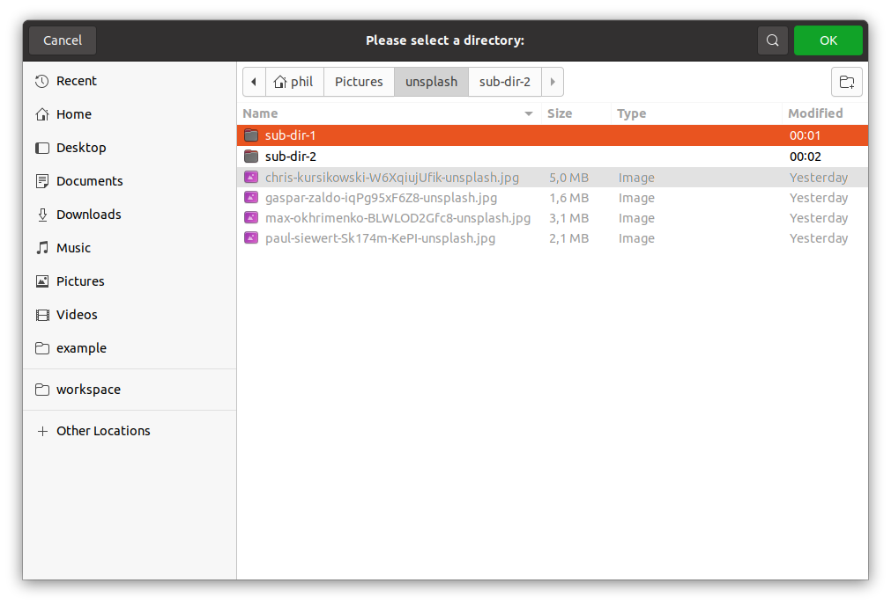
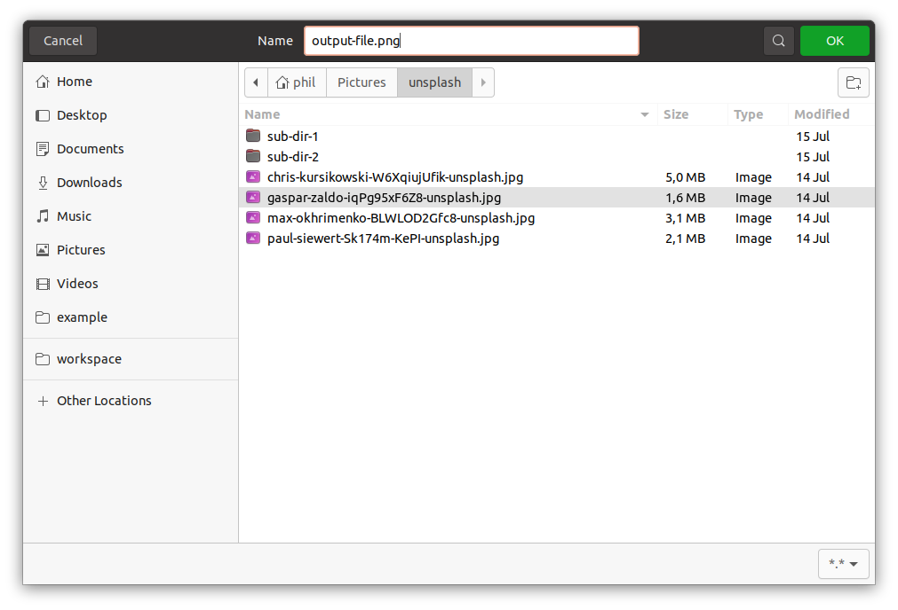
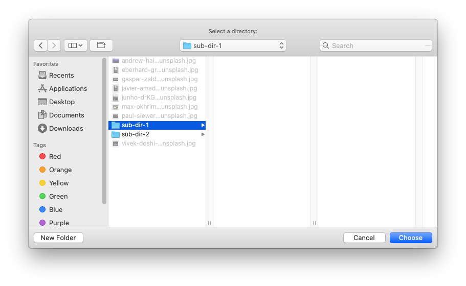
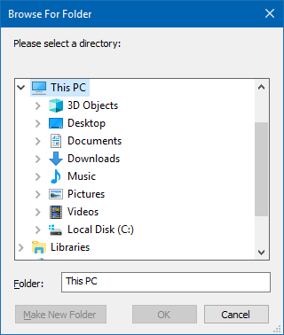
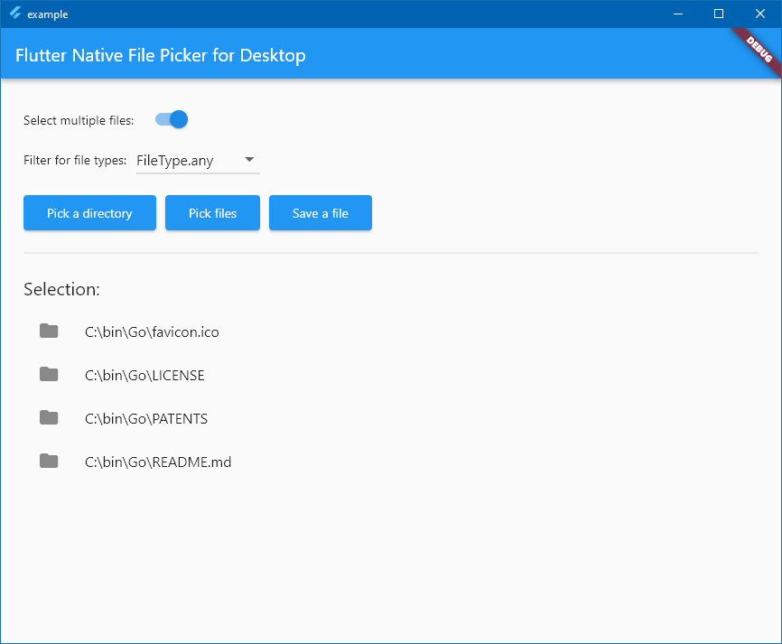

# File Picker Desktop

<a href="https://github.com/philenius/flutter_file_picker_desktop/actions/workflows/main.yml"></a> <a href="https://pub.dev/packages/file_picker_desktop"></a> <a href="https://github.com/philenius/flutter_file_picker_desktop/issues"></a> 

This repository contains a Dart package that allows you to use a native file explorer on Windows, macOS, and Linux for three things:

* picking files
* picking directories
* saving files


## Features

* :tada: This package **does not require** [Go Flutter](https://github.com/go-flutter-desktop/go-flutter). This package is written entirely in Dart!!! No dependencies on Go or Go Flutter.
* :floppy_disk: Simple API for picking a single file or multiple files with support for filtering the allowed file extensions.
* :file_folder: Simple API for picking a directory.
* :cd: Simple API for saving a file.
* :wrench: Different filtering options for file types included (+ customizable).
* :tada: Customizable title of the dialog.
* :robot: Runs on Linux, macOS, and Windows.


**:warning: This package does not support Android, iOS, or the web. Please refer to Miguel Pruivo's package [github.com/miguelpruivo/flutter_file_picker](https://github.com/miguelpruivo/flutter_file_picker/) which offers the same functionality for Android, iOS, and the web. I tried my best to provide the same API as Miguel's package.**


The following screenshots show the file picker dialog on Linux, macOS, and Windows:


| Linux File Picker                                            | Linux Directory Picker                                       | Linux Save File Dialog                                       |
| ------------------------------------------------------------ | ------------------------------------------------------------ | ------------------------------------------------------------ |
|  |  |  |
| **macOS File Picker**                                        | **macOS Directory Picker**                                   | **macOS Save File Dialog**                                   |
|  |  |                                                              |
| **Windows**                                                  | **Windows Directory Picker**                                 | **Windows Save File Dialog**                                 |
|  |  |                                                              |


## Usage

### Add package to `pubspec.yaml`:

```yaml
...

dependencies:
  file_picker_desktop: ^1.1.0

```

### Import:

```dart
import 'package:file_picker_desktop/file_picker_desktop.dart';
```

### Dialog for picking a single File:

```dart
try {
  final result = await pickFiles(
    allowMultiple: false,
  );
  if (result != null) {
    File file = File(result.files.single.path);
  } else {
    // User canceled the picker
  }
} catch (e) {
  print(e);
}
```

### Dialog for picking multiple files:

```dart
try {
  final result = await pickFiles(
    allowMultiple: true,
  );
  if (result != null) {
    List<File> files = result.paths
        .where((path) => path != null)
        .map((path) => File(path!))
        .toList();
  } else {
    // User canceled the picker
  }
} catch (e) {
  print(e);
}
```

### Dialog for picking multiple files with extension filter:

```dart
final result = await pickFiles(
  allowMultiple: true,
  type: FileType.custom,
  allowedExtensions: ['jpg', 'pdf', 'doc'],
);
```

### Load the results and file details:

```dart
FilePickerResult? result = await pickFiles();

if (result != null) {
  PlatformFile file = result.files.first;

  print(file.name);
  print(file.bytes);
  print(file.size);
  print(file.extension);
  print(file.path);
} else {
  // User canceled the picker
}
```

### Dialog for picking a directory:

```dart
try {
  final selectedDirectory = await getDirectoryPath();
  if (selectedDirectory != null) {
    File directory = File(selectedDirectory);
  } else {
    // User canceled the picker
  }
} catch (e) {
  print(e);
}
```

### Dialog for saving a file:

```dart
try {
  final String? selectedFileName = await saveFile(
    defaultFileName: 'default-file.txt',
  );

  if (selectedFileName != null) {
  	File file = File(selectedFileName);
  } else {
    // User canceled the picker
  }
} catch (e) {
    print(e);
}
```


## Example Flutter App



The directory `./example/` contains an example Flutter app which showcases the file picker's functionality. You can run this example app the following way:

```bash
cd ./example/

flutter create .

# Choose the appropriate option depending on your OS
flutter config --enable-linux-desktop
flutter config --enable-macos-desktop
flutter config --enable-windows-desktop

flutter run
```
